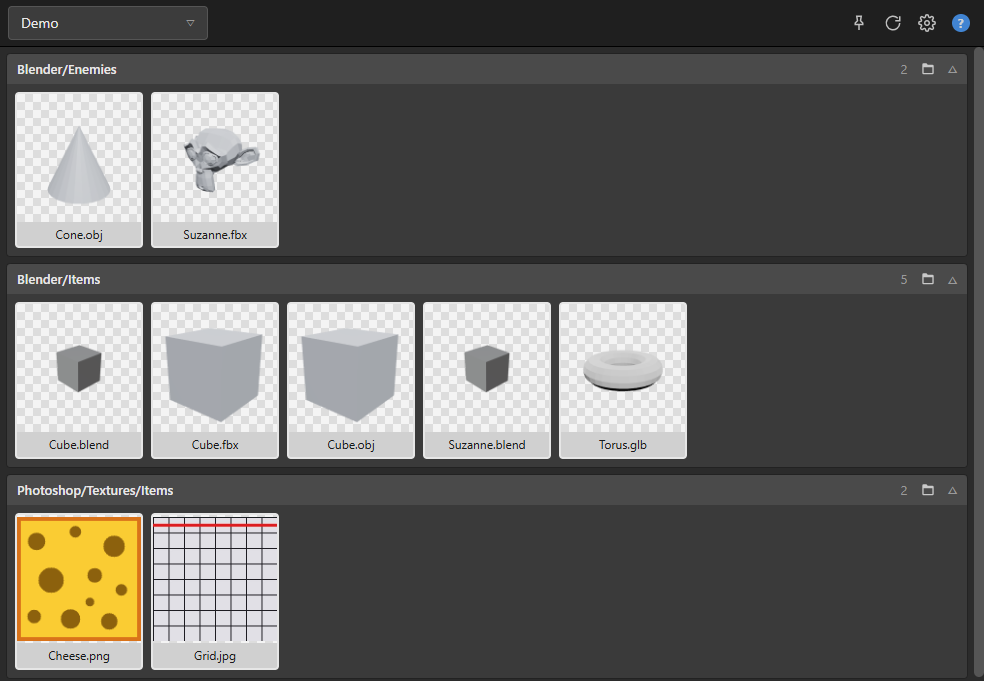

# Asset Library

A small Windows desktop app for keeping track of game assets that live in several folders. You create a project, point it at your Blender and Photoshop export folders, and every subfolder shows up as a collapsible category with thumbnails. From there you drag a file straight into Unity or Explorer, or rename, move and delete it in place.

It exists because switching between Explorer windows while working in Blender and Unity gets old fast, and keeping a tidy folder structure makes it worse, not better.

Built with Electron, React and TypeScript. 3D thumbnails are rendered with three.js.



## Download

Windows builds are attached to each release on the [Releases page](https://github.com/NupsNils/Asset-Library/releases).

- `Asset Library-<version>-portable.exe` runs without installation.
- `Asset Library-<version>-x64.exe` is an installer that adds a desktop shortcut.

The binaries are not code-signed, so Windows SmartScreen shows a warning the first time. Choose "More info" and then "Run anyway".

## Features

- **Projects.** Each project has one or more library folders. Switch projects from the dropdown in the top-left corner.
- **Categories from folders.** Every folder below a library folder that contains matching files becomes one collapsible category, labelled with its path relative to the library folder (`Blender/Items`, `Photoshop/Textures/Items`). Collapsed state is remembered per category.
- **Thumbnails.** Images use the Windows shell thumbnail, so they look the same as in Explorer. FBX, OBJ, GLB and GLTF files are rendered once with three.js. `.blend` files use the preview image Blender embeds in the file. Everything is cached on disk and only re-rendered when the file changes.
- **Native drag and drop.** Dragging a tile starts a real OS file drag (`CF_HDROP`), so Unity's Project window, Explorer and any other application accept it exactly like a file dragged from Explorer. The target application copies the file.
- **Drop to import.** Drop files from Explorer onto a category to copy them into that folder. Hold Shift to move instead.
- **File management.** Rename inline, move files between categories, delete to the Recycle Bin, open in the default application, reveal in Explorer. Multi-select with Ctrl and Shift.
- **Automatic refresh.** Library folders are watched, so a new Blender export appears without pressing anything.
- **Always on top.** A toggle in the header keeps the window above Unity or Blender.
- **Configurable.** File types and thumbnail size can be changed in the settings.

## Usage

On first start in a development checkout, a project called "Demo" points at the bundled `samples/DemoProject` folder. In the packaged app, start by creating a project:

1. Open the project dropdown (top-left) and choose "New project…".
2. Give it a name and use "Add folder…" to add one or more library folders, for example `MyGame/Blender` and `MyGame/Photoshop`.
3. Every subfolder that contains supported files is now listed as a category. "Edit project…" in the same dropdown lets you rename the project or change its folders later.

### Controls

| Action | Result |
| --- | --- |
| Drag a tile | Native drag to Explorer, Unity or any other application (the target copies the file) |
| Alt + drag a tile onto a category | Move the file into that category |
| Drop files from Explorer onto a category | Copy them into that folder; hold Shift to move |
| Double-click | Open in the default application |
| Right-click | Open, Reveal in Explorer, Rename, Move to…, Recycle Bin |
| Ctrl + click, Shift + click, Ctrl + A | Multi-select |
| F2 | Rename |
| Delete | Move to the Recycle Bin (asks for confirmation) |
| F5 | Rescan |
| Esc | Clear selection |
| Folder icon in a category header | Open that folder in Explorer |
| Pin icon in the header | Toggle always on top |

Default file types: `.fbx .obj .glb .gltf .blend .png .jpg .jpeg .psd`. Change them in the settings (gear icon).

### Where data is stored

Everything lives in `%APPDATA%\asset-library`:

- `config.json` – projects, library folders, settings, collapsed categories
- `thumbs\` – thumbnail cache, keyed by file path, modification time and size

The development build and the packaged app share this folder. Nothing is written into your library folders.

## Development

Requirements: Windows 10 or 11, Node.js 22 or newer (developed with Node 24).

```bash
npm install
npm run dev
```

| Script | Purpose |
| --- | --- |
| `npm run dev` | Start the app with hot reload |
| `npm run build` | Production build into `out/` |
| `npm run preview` | Run the production build |
| `npm run typecheck` | Type-check main, preload and renderer |
| `npm run smoke` | Headless self-test: scans `samples/`, renders every thumbnail, exercises import, rename, move and Recycle Bin |
| `npm run test:blend` | Runs the `.blend` thumbnail parser against the sample files |
| `npm run dist` | Build the installer and portable EXE into `dist/` |

Pushing a tag such as `v0.2.0` triggers the release workflow, which builds both executables on GitHub Actions and attaches them to a release.

### Project layout

```
src/main       Electron main process: config, folder scanner, file watcher, file operations, thumbnails, IPC
src/preload    contextBridge that exposes a typed window.api to the renderer
src/renderer   React UI, plus thumbWorker.ts (three.js renderer running in a hidden window)
src/shared     Types shared by all three
samples/       Example library, generated with Blender (samples/generate-samples.py)
scripts/       Smoke test, .blend parser test, icon generator
docs/          Planning notes (German)
```

### How thumbnails work

The renderer asks the main process for a thumbnail. The main process computes a cache key from path, modification time and size and returns the cached PNG through a custom `thumb://` protocol if it exists. Otherwise:

- Images go through `nativeImage.createThumbnailFromPath`, which uses the Windows shell.
- 3D files are sent to a hidden `BrowserWindow` that runs three.js. It loads the file through an `asset://` protocol restricted to the current project's library folders, replaces materials with a neutral grey, frames the bounding box and returns a PNG.
- `.blend` files are parsed directly: the parser reads the `TEST` block that Blender writes into every file, and handles both the legacy 12-byte header and the 17-byte large-file header used since Blender 4.5, as well as zstd-compressed files.

## Known limitations

- Windows only. Shell thumbnails, the Recycle Bin and the drag format are Windows APIs.
- Drag-out always copies. Electron only allows copy and link as drag effects, so the target cannot move the file.
- FBX and OBJ thumbnails use a plain grey material; textures next to the file are not loaded.
- PSD thumbnails only appear if a PSD thumbnail handler is installed (for example by Photoshop).
- `.blend` files saved from a script in background mode contain a placeholder cube as their preview. Files saved from the Blender UI show the real viewport.
- Folders dropped from Explorer are skipped; only files are imported.

## License

MIT, see [LICENSE](LICENSE).
